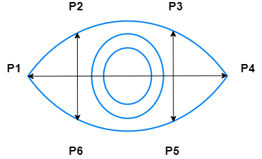

# Driver_Sleep_Detection
A Computer Vision based Project to check if the driver of a vehicle is sleepy.

# About the Project

The main idea of this project is to protect drivers who travel a long distance, especially during the night time, and are prone to feel sleepy.

The project can be deployed on a Raspberry Pi and can be installed along with a camera on the dashboard of the car. The system will automatically check if the person is sleepy and sound an alarm when the person seems to be sleepy.

The project checks for two things. The first part is already implemented before. I here try to add the yawn detector as an additional feature.

1. If the person's eyes are closed continuously, then the person has slept (or is very sleepy) and an ALERT is sent out as this is critical.
2. If the person is yawning more than a number of times under a particular time, that means is extremely sleepy and a WARNING is sent out.

The first part of the project is inspired [here](https://pyimagesearch.com/2017/05/08/drowsiness-detection-opencv/).

# Working of the Project

## Part 1: Sleep Detector

1. The first step is to detect if a face can be identified using the [dlib](http://dlib.net/) library.
2. Once a face is found, the coordinates of the eye are selected. The coordinates of the face are shown in the [image](https://www.researchgate.net/publication/343699139_A_framework_for_facial_age_progression_and_regression_using_exemplar_face_templates) below. 
    
    
3. Once the eyes are identified, the Eye Aspect Ratio (EAR) for each eye is calculated using the equation shown below.
   
   

    

4. The average EAR of both eyes is taken.
5. If the Average EAR of both eyes falls below a threshold for a given consecutive number of frames, then the alarm is sounded and the driven can be woken.
6. A simple experiment can find the threshold of each driver/person.
   1. Simple run the main program using the command `python main.py`.
   2. Ask the person to keep his eyes open for some time and then make a quick blink, then ask him to keep it open, and then a bigger blink.
   3. Then stop the program by pressing the `q` key.
   4. Open the file `Graphs\EAR.png`.
   5. You can see the visualized EAR against the frame in this graph and from this, you can identify and set the EAR_threshold.
   6. Modify this in the `config.json`.
   7. A sample graph is shown in the image below. The red block represents a blink event.
   
    

## Part 2: Yawn Detector
7. On a similar basis the yawn detector also works and sents our WARNINGS. The parameters can be adjusted in the `config.json`.
8. The yawn detector basically checks if a person yawns, and if the yawn is detected based on if MAR exceeds the `MAR_threshold`.
9. If there are more than a defined number of yawns `number_of_yawns` in a specified number of frames (defined by `number_of_frames_yawns`), then an ALARM is sounded.
10. On a similar basis as defined in point 6, the thresholds can be detected and set.

# Prerequisites for Windows

1. Install [CMake](https://cmake.org/download/): Since dlib is C-based, CMake is required for the build. Also, add CMake to your Environment Variables.
2. Install Visual Studio [here](https://visualstudio.microsoft.com/visual-cpp-build-tools/): Also install additional package Packages `CMake tools for Windows`.

# Run the Code

1. It is highly recommended to use a virtual environment. A medium article for this can be found [here](https://medium.com/swlh/create-a-python-virtual-environment-with-built-in-venv-module-109f71dccbdf).
2. Download the dblib models for face detection [here](http://dlib.net/files/shape_predictor_68_face_landmarks.dat.bz2).
3. Install requirements.txt using pip `install -r requirements.txt`

4. In order to test or run the code, run the command `python main.py`
   
# Additional Information

## Python Version

The whole project is developed with the python version `Python 3.7.7` and pip version `pip 19.2.3`.

## Contact
In case of an error, feel free to contact me over Linkedin at [Adnan](https://www.linkedin.com/in/adnan-karol-aa1666179/).

