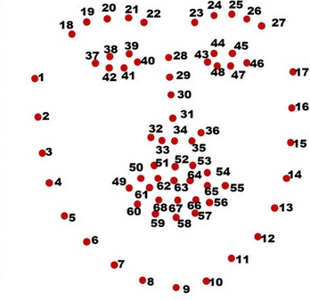

# Driver_Sleep_Detection
A Computer Vision based Project to check if the driver of a vehicle is sleepy

# About the Project

The main idea of this project is to protect drivers who travel a long distance, especially during the night time, and are prone to feel sleepy.

The project can be deployed on a Raspberry Pi and can be installed along with a camera on the dashboard of the car. The system will automatically check if the person is sleepy and sound an alarm when the person seems to be sleepy.

The project is inspired by [here](https://pyimagesearch.com/2017/05/08/drowsiness-detection-opencv/).

# Working of the Project

1. The first step is to detect if a face can be identified using the [dlib](http://dlib.net/) library.
2. Once a face is found, the coordinates of the eye are selected. The coordinates of the face are shown in the [image](https://www.researchgate.net/publication/343699139_A_framework_for_facial_age_progression_and_regression_using_exemplar_face_templates) below. 
    
    
3. Once the eyes are identified, the Eye Aspect Ratio (EAR) for each eye is calculated using the equation shown below.
   
   

    

4. The average EAR of both eyes is taken.
5. If the Average EAR of both eyes falls below a threshold for a given consecutive number of frames, then the alarm is sounded and the driven can be woken.

# Prerequisites for Windows

1. Install [CMake](https://cmake.org/download/): Since dlib is C-based, CMake is required for the build. Also, add CMake to your Environment Variables.
2. Install Visual Studio [here](https://visualstudio.microsoft.com/visual-cpp-build-tools/): Also install additional package Packages `CMake tools for Windows`

# Run the Code

1. Download the dblib models for face detection [here](http://dlib.net/files/shape_predictor_68_face_landmarks.dat.bz2).
2. Install requirements.txt using pip `install -r requirements.txt`

3. In order to test or run the code, run the command `python main.py`
   
# Additional Information

## Python Version

The whole project is developed with python version `Python 3.7.7` and pip version `pip 19.2.3`.

## Contact
In case of an error, feel free to contact me over Linkedin at [Adnan](https://www.linkedin.com/in/adnan-karol-aa1666179/).

