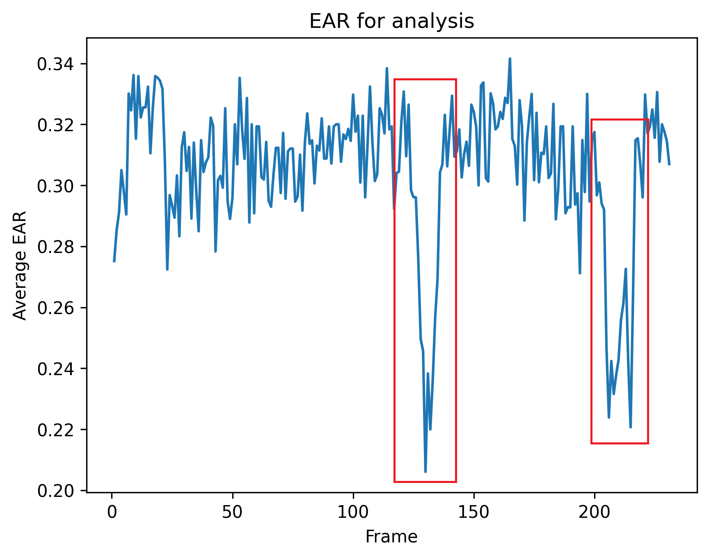

# DrowsyDriverDetection

**Driver Sleep Detection** is a computer vision-based project designed to monitor driver alertness by detecting signs of drowsiness. This system can be deployed on a Raspberry Pi with a camera mounted on the dashboard to help ensure driver safety during long trips, especially at night.

## About the Project

The primary goal of this project is to enhance road safety by alerting drivers who may be falling asleep. The system is equipped with two key detection features:

1. **Eye Closure Detection**: Alerts are triggered if the driver’s eyes remain closed for a prolonged period.
2. **Yawn Detection**: Warnings are issued if the driver yawns frequently, indicating high levels of fatigue.

This project extends previous work on drowsiness detection by incorporating an additional yawn detection feature.

## Working of the Project

### Part 1: Sleep Detector

1. **Face Detection**: Uses the [dlib](http://dlib.net/) library to identify faces in the video feed.
2. **Eye Coordinates**: Determines the coordinates of the eyes on the face. Refer to the image below for details on eye coordinates:

    

3. **Eye Aspect Ratio (EAR)**: Computes the EAR for each eye using the formula:

    

4. **EAR Calculation**: Takes the average EAR for both eyes. If the average EAR falls below a predefined threshold for a specified number of consecutive frames, an alarm is triggered.
5. **Threshold Determination**: Run the main program (`python main.py`) to record EAR values and adjust the EAR threshold accordingly. Refer to the `Graphs\EAR.png` file for a visual representation:

    

### Part 2: Yawn Detector

6. **Yawn Detection**: Monitors yawning by calculating the Mouth Aspect Ratio (MAR) and comparing it to a threshold. If MAR exceeds the threshold and multiple yawns are detected within a defined frame range, a warning is issued.
7. **Parameter Configuration**: Adjust yawn detection parameters in the `config.json` file.

## Prerequisites for Windows

1. **CMake**: Download and install [CMake](https://cmake.org/download/) and ensure it is added to your Environment Variables.
2. **Visual Studio**: Install Visual Studio from [here](https://visualstudio.microsoft.com/visual-cpp-build-tools/) along with the `CMake tools for Windows` package.

## Running the Code

1. **Virtual Environment**: It is recommended to use a virtual environment. For guidance, refer to this [Medium article](https://medium.com/swlh/create-a-python-virtual-environment-with-built-in-venv-module-109f71dccbdf).
2. **Download dlib Models**: Obtain the dlib model for face detection from [this link](http://dlib.net/files/shape_predictor_68_face_landmarks.dat.bz2).
3. **Install Dependencies**: Use pip to install the required packages:

    ```sh
    pip install -r requirements.txt
    ```

4. **Run the Code**: Execute the following command to start the application:

    ```sh
    python main.py
    ```

## Additional Information

### Python Version

This project was developed using Python 3.7.7 and pip 19.2.3.

### Contact

For any issues or questions, please reach out to me on LinkedIn: [Adnan](https://www.linkedin.com/in/adnan-karol-aa1666179/)
